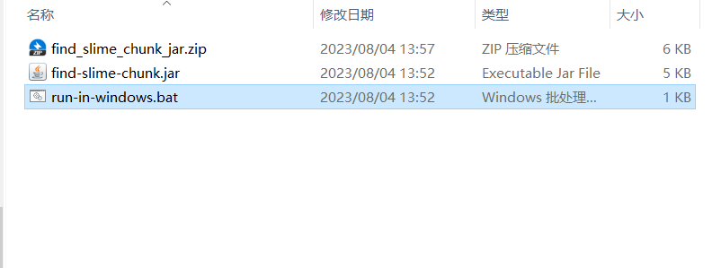
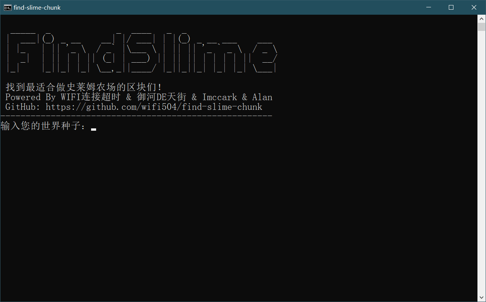
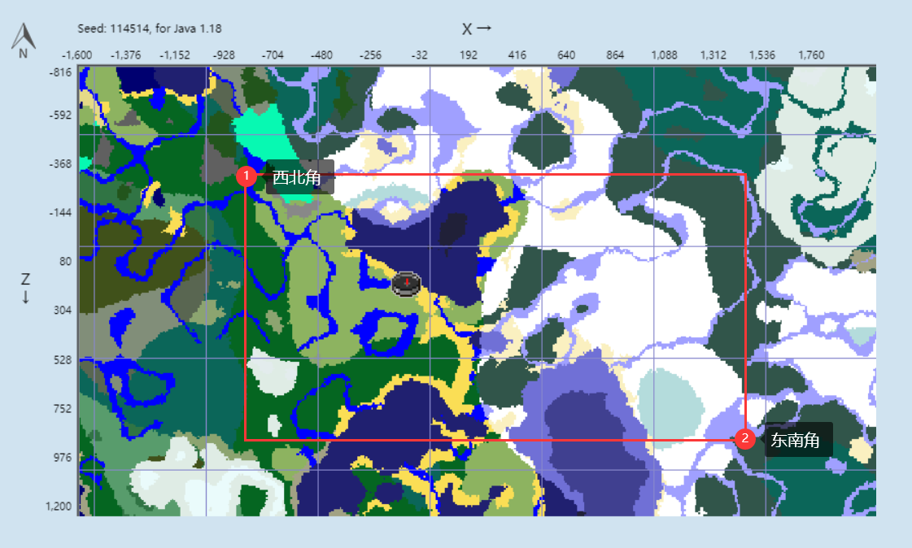
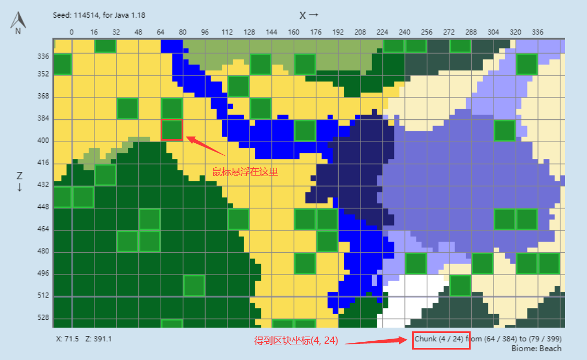
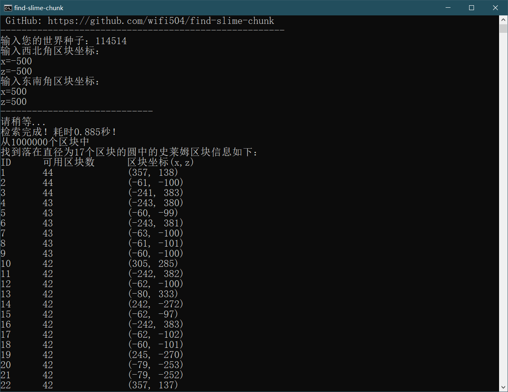
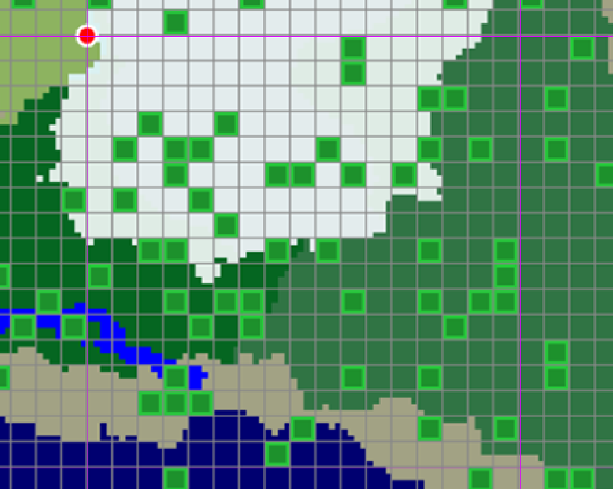
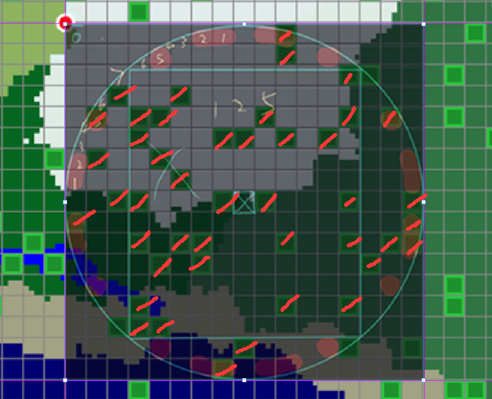

# find-slime-chunk

一个专为设计史莱姆农场的区块查找器

### 概述

根据种子，查找指定范围内史莱姆区块数量最多的地方，史莱姆区块的生成概率是1/10，但这是由一种伪随机算法实现的，并且分布并不均匀，我们可以通过此工具查找最适合挂机与炸空置域修切门史莱姆农场的地方。

### 程序功能

输入地图种子与2个区块的坐标，在这两个坐标框出的矩形范围内查找直径为17的圆内最多的史莱姆区块的圆的位置。

众所周知以玩家为中心128格半径的球形区域都是刷怪范围，也就是128/16=8个区块的半径，加上玩家自己所在的区块，则需要找直径为17区块的圆形区域。

本程序受 [啥都不会的echofff  制作的  史莱姆区块范围查找器](https://www.bilibili.com/read/cv14895008) 启发，但显然作者通过直接查找**正方形**的方式只能得到一个局部最优解，最后在和我们服里3位伙伴激情探讨后设计出能得到全局最优解的本程序。

### 使用

1. 下载 [Release](https://github.com/wifi504/find-slime-chunk/releases/download/v1.0/find_slime_chunk_jar.zip) ，解压并双击`run-in-windows.bat` 运行程序

   

   

2. 按照提示填入种子号与坐标

   

   具体的，打开 [chunkbase](https://www.chunkbase.com/apps/seed-map) 输入对应种子号，区块坐标如图所示

   

   将鼠标悬停在指定区块上可查看到区块坐标（和世界坐标呈1:16关系），区块坐标是你要填入本程序的坐标

   

   如果你在游戏中，使用 `/seed` 指令可获得当前世界种子号

3. 等待一段时间后，将展示前100项结果

   

   我们可以看到，在(357, 138)处的圆形区域，有44个可用的史莱姆区块

   验证：

   

   

   数量确实为44，结果正确

### 注意事项

请注意，过大的范围可能会带来较久的运算时间，本示例中遍历了1000000个区块耗费了0.885秒，在我们服务器实际使用时遍历了1亿个区块耗费了137.151秒，计算机性能不一，仅供参考。

如果在使用时遇到什么bug欢迎提issues反馈，本程序使用的是无脑暴力遍历算法，如果您愿意优化出速度更快的算法欢迎提pr！

以上，如有其他也可以到B站私信联系我 ~ 

### 技术栈

Java

### 开源协议

GNU General Public License v3.0

### 特别鸣谢

御河DE天街 · 怪物生成机制

Imccark · 史莱姆区块判定机制

jiaranmiao555(Alan) · 思路贡献

